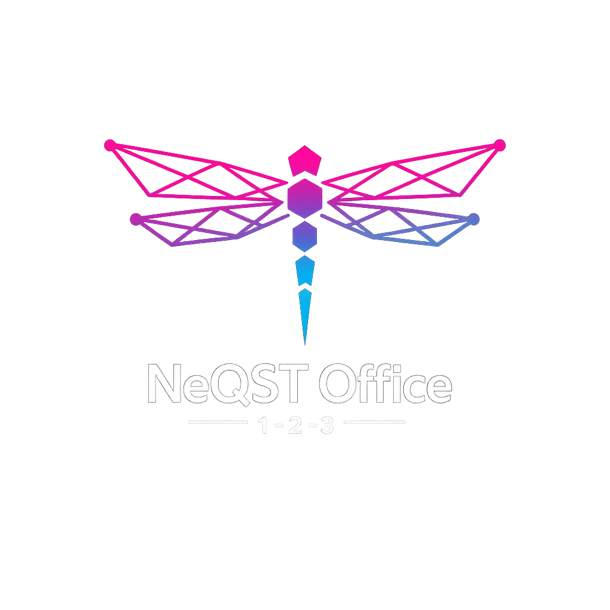

  

# 
NeQST Office 1-2-3

### 
The Sovereign, Decentralized, and Quantum-Ready Desktop & Web Suite

  
  

> **"The ultimate answer to Microsoft 365 and corporate cloud silos."**  
> Built for the next decades (2030x and beyond) on the reliable shoulders of Open Source history, with a radical leap into future architecture.

---

## 👁️ Die Vision

Im Juni 2026 ist der Markt für Bürosoftware zersplittert. Große europäische Cloud-Anbieter versuchen mit Initiativen wie *Euro-Office*, rein webbasierte Lösungen zu etablieren, um eigene Infrastrukturen zu monetarisieren. Die *LibreOffice Foundation* kritisiert dies völlig zu Recht als Alibi-Souveränität und "De-facto-Verbündete" der US-Monopole, da kritische offene Standards und echte Client-Unabhängigkeit auf der Strecke bleiben.

**NeQST Office 1-2-3** bricht diesen Kreis. Wir bauen keinen Klon von Microsoft 365 und kein isoliertes Web-Silo. Wir vollziehen den lang ersehnten **Zeitsprung**: Wir bringen die legendäre, nahtlose Interoperabilität und Nutzerzentrierung von *Lotus Notes*, *Lotus 1-2-3* und *Ami Pro* direkt in die Moderne – als freie, unknackbare und dezentrale All-in-One-Suite.

---

## 🏗️ Technologische Architektur (The Trio of Power)

Um die Trägheit alter C++-Codebasen zu überwinden, ohne das Rad bei der Dokumentenkompatibilität neu zu erfinden, trennen wir Kern und Oberfläche radikal:

1. **The Engine: Headless LibreOffice 24+**  
   Wir nutzen den mächtigen, bewährten Kern von LibreOffice über das *LibreOfficeKit* als reine, headless Rechenmaschine. Keine Altbacken-GUI, kein UNO-Frust. Nur pure Rendering- und Formatierungspower.
   
2. **The Face: Synchronous Flutter Dual-Frontend**  
   Eine einzige, hochmoderne Codebasis in Dart/Flutter liefert eine pixelgenaue, kontextsensitive und rasend schnelle GUI – simultan als **native Desktop-App** (Linux, Windows) und als **Web-App**. Volle Interoperabilität: Text, Tabelle, Präsentation, Mail und Kalender leben nahtlos vereint in *einem* Tab-System.
   
3. **The Brain: SurrealDB (Embedded Rust)**  
   Schluss mit starren Ordnerstrukturen oder korrupten Outlook-PST-Datengräbern. Ein kryptographisch abgesicherter **NoSQL-Multi-Model-Wissensgraph** verbindet Mails, Termine, Kontakte und Dokumente. 

---

## 🛡️ Souveränität & Zero-Trust (BSI-konform)

* **Offline-First & Dezentral:** Funktioniert komplett ohne Internet auf dem Einzelplatz-PC, skaliert aber nahtlos bis zu 5000+ Nutzern.
* **Der Arbeitsplatz als Mini-Server:** Jede lokale Instanz kann als verschlüsselter Webservice fungieren, um via Mobilgerät remote und sicher auf das eigene Office zuzugreifen.
* **Krypto-Festung:** Native Ende-zu-Ende-Verschlüsselung (E2EE) im Ruhezustand und bei der Peer-to-Peer-Synchronisation (über VPN, Tor/Onion) direkt auf Basis der Rust-Core-Sicherheit.

---

## 🛣️ Roadmap / Next Steps

- [ ] **Phase 1:** Spezifikation des SurrealDB Graph-Datenmodells für PIM (Mail/Kalender/Kontakte).
- [ ] **Phase 2:** Design des modernen "Lotus-Moderne" Frontend-Skeletts in Flutter.
- [ ] **Phase 3:** Implementierung der C-Bindings zum Headless LibreOffice Core (LibreOfficeKit).
- [ ] **Phase 4:** Integration des leichtgewichtigen, dezentralen P2P-Webservers.

---

## 🤝 Mitmachen / Contribute

Dieses Projekt wird architektonisch und konzeptionell vorangetrieben, setzt aber stark auf KI-gestützte Code-Generierung und die Power der Open-Source-Community. Wenn du Rust-, Flutter/Dart- oder C++-Experte bist und die digitale Souveränität auf das nächste Level heben willst: **Let's code history together.**

**Main Repository:** [Codeberg (neqst/office-123)](https://codeberg.org/neqst/office-123)  
*Note: The GitHub repository is a read-only mirror. Please submit PRs and Issues on Codeberg.*

---
License: AGPLv3 / MPL 2.0 (Dual-Licensed for maximum freedom and ecosystem protection)
